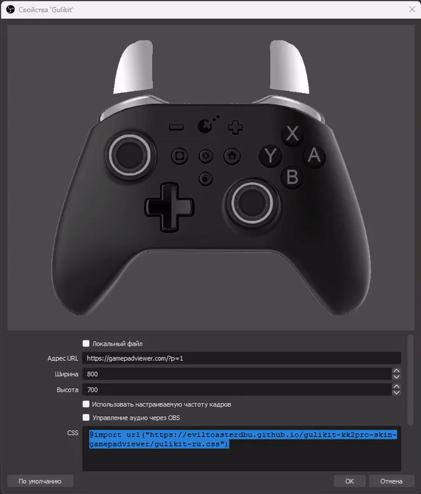

# How to?
In OBS add a "Browser" source with the link `https://gamepadviewer.com/?p=1` , width 800 and height 700. 
In CSS add code: `item: @import url("https://eviltoasterdbu.github.io/gulikit-kk2pro-skin-gamepadviewer/gulikit.css")`

# А как?
В OBS добавьте источник "Браузер" с сылкой https://gamepadviewer.com/?p=1 , шириной 800 и высотой 700. 
В CSS добавьте код: `@import url("https://eviltoasterdbu.github.io/gulikit-kk2pro-skin-gamepadviewer/gulikit-ru.css")`

# Preview/Превью

