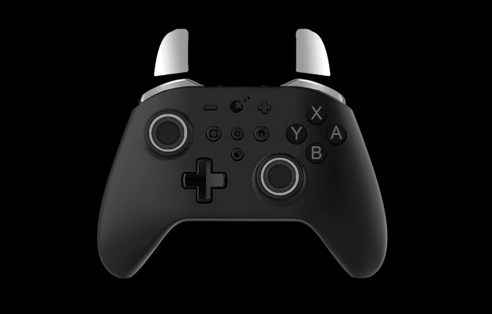

# How to?
In OBS add a "Browser" source with the link `https://gamepadviewer.com/?p=1` , width 800 and height 700. 
In CSS add code: `item: @import url("https://gulikit.toshta.ru/gulikit.css")` 
Or use `https://gamepadviewer.com/?editcss=https://gulikit.toshta.ru/gulikit.css` as source.

# А как?
В OBS добавьте источник "Браузер" с сылкой `https://gamepadviewer.com/?p=1` , шириной 800 и высотой 700. 
В CSS добавьте код: `@import url("https://gulikit.toshta.ru/gulikit-ru.css")` 
Или используйте ссылку `https://gamepadviewer.com/?editcss=https://gulikit.toshta.ru/gulikit-ru.css` как источник.

# Preview/Превью

